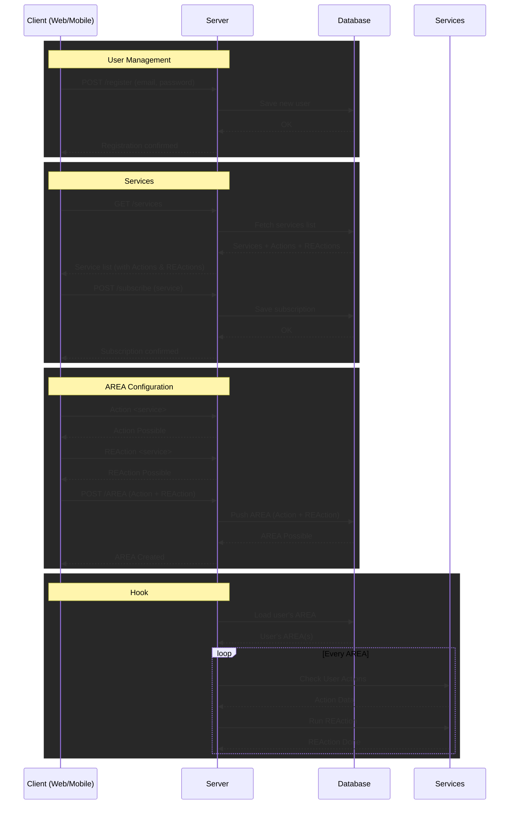

# SequenceDiagram AREA 

```mermaid
sequenceDiagram
    participant C as Client (Web/Mobile)
    participant S as Server
    participant DB as Database
    participant A as Services

    rect rgb(40,40,40)
    note over C,S: User Management
        C->>S: POST /register (email, password)
        S->>DB: Save new user
        DB-->>S: OK
        S-->>C: Registration confirmed
    end
    rect rgb(40,40,40)
    note over C,S: Services
        C->>S: GET /services
        S->>DB: Fetch services list
        DB-->>S: Services + Actions + REActions
        S-->>C: Service list (with Actions & REActions)
    
        C->>S: POST /subscribe (service)
        S->>DB: Save subscription
        DB-->>S: OK
        S-->>C: Subscription confirmed
    end
    rect rgb(40,40,40)
    note over C,S: AREA Configuration
        C->>S: Action <service>
        S-->>C: Action Possible
        C->>S: REAction <service>
        S-->>C: REAction Possible
        C->>S: POST /AREA (Action + REAction)
        S->>DB: Push AREA (Action + REAction)
        DB-->>S: AREA Possible
        S-->>C: AREA Created
    end
    rect rgb(40,40,40)
    note over C,S: Hook
        S->>DB: Load user's AREA
        DB-->>S: User's AREA(s)
        loop Every AREA
            S->>A: Check User Actions
            A-->>S: Action Data
            S->>A: Run REAction
            A-->>S: REAction Done
        end
    end
```
